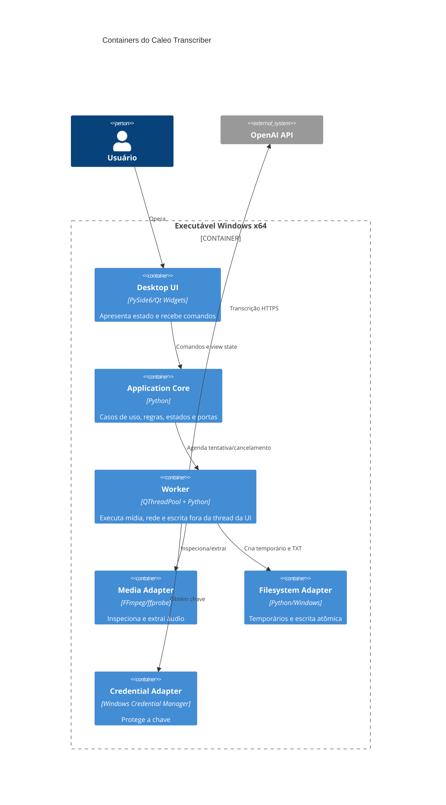

# Containers e implantação

- **Status:** proposta para aprovação
- **Data:** 2026-07-31

## Containers

## Implantação

- Um único pacote instalável para Windows 10 x64; nenhum serviço residente.
- Python e Qt são empacotados; o usuário não instala runtime ou usa terminal.
- `ffmpeg.exe` e `ffprobe.exe` são dependências nativas empacotadas e invocadas sem shell.
- Rede é usada somente pelo adaptador OpenAI e por funcionalidades futuras explicitamente autorizadas.
- A primeira escolha de empacotador é PyInstaller em modo `onedir`; `onefile` fica rejeitado inicialmente por pior diagnóstico, extração temporária no startup e maior complexidade com binários Qt/FFmpeg.

## Decisão de concorrência

A UI roda na thread principal. Cada tentativa roda em worker dedicado, com cancelamento cooperativo. Na primeira fatia existe no máximo uma tentativa ativa. Processos FFmpeg recebem handle explícito e são encerrados em cancelamento. A chamada HTTP possui timeouts finitos; seu cancelamento é de melhor esforço.

