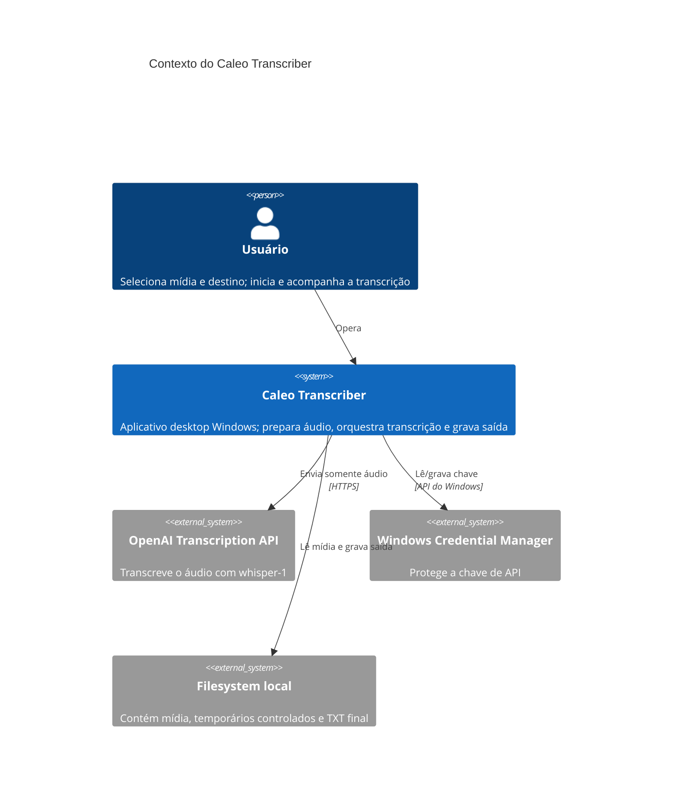

# Contexto arquitetural — Caleo Transcriber

- **Status:** aprovado
- **Owner:** `caleo-hub`
- **Data:** 2026-07-31
- **Escopo:** primeira fatia aprovada em `specs/features/FEAT-001-transcribe-single-file.md`

## Sistema e fronteiras

O Caleo Transcriber é um aplicativo desktop pessoal, executado em Windows 10 x64, sem backend próprio, banco, telemetria ou histórico. Ele lê uma mídia escolhida pelo usuário, extrai/prepara áudio localmente, envia esse áudio à OpenAI quando o usuário inicia no modo cloud e grava um TXT no diretório escolhido.

## Fluxos de dados

1. O caminho da mídia fica somente em memória durante a tentativa.
2. FFmpeg lê MP4/MP3/WAV e produz áudio temporário comprimido, sem vídeo.
3. A chave é recuperada do cofre do Windows apenas no momento da chamada.
4. O adaptador OpenAI envia áudio por HTTPS para `/v1/audio/transcriptions` com `model=whisper-1`.
5. O texto retornado é normalizado sem alteração semântica e gravado atomicamente em UTF-8.
6. Temporários são removidos em sucesso, falha ou cancelamento; sobras de encerramento abrupto são limpas na próxima abertura.

## Fora da fronteira desta fatia

- Whisper local, SRT, segmentos, fila, mídia acima de 30 minutos e paralelismo;
- backend, conta de usuário, sincronização, histórico e telemetria;
- envio do contêiner de vídeo ou de caminhos locais à OpenAI.

## Fontes externas normativas

- [OpenAI — File transcription](https://developers.openai.com/api/docs/guides/speech-to-text)
- [OpenAI — Create transcription](https://developers.openai.com/api/reference/resources/audio/subresources/transcriptions/methods/create)
