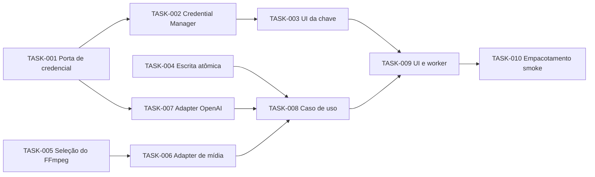

# Plano do primeiro incremento funcional

- **Status:** aprovado para execução sequencial
- **Data:** 2026-07-31
- **Objetivo:** entregar a primeira fatia aprovada, incluindo configuração segura da chave necessária para uma instalação utilizável
- **Spec:** `specs/features/FEAT-001-transcribe-single-file.md`

## Resultado do incremento

Em Windows 10 x64, a pessoa instala o aplicativo, salva a chave OpenAI pela interface, escolhe um MP4/MP3/WAV de até 30 minutos e um destino, inicia a transcrição cloud visível e recebe TXT sem sobrescrita. A aplicação permanece responsiva, mostra etapas honestas, permite cancelamento de melhor esforço e não mantém histórico.

## Grafo de dependências

T2, T4, T5 e a preparação contratual de T7 podem avançar após T1 em branches separadas. T6 depende da decisão/evidência de T5. T8 só começa quando filesystem, mídia e provider estiverem aceitos. T9 integra fluxos já testados; não inventa regras.

## Sequência e gates

| Ordem | Tarefa | Tipo | Resultado observável | Gate humano |
|---:|---|---|---|---|
| 1 | TASK-001 | implementação/teste | porta e fake de credencial | revisão normal |
| 2 | TASK-002 | segurança/integração | chave sintética round-trip no cofre | revisar ausência em logs/disco |
| 3 | TASK-003 | UI | salvar/testar/substituir/remover pela tela | aprovar UX e aviso |
| 4 | TASK-004 | implementação | TXT atômico sem sobrescrita | revisão normal |
| 5 | TASK-005 | investigação | build FFmpeg com origem/licença/checksum | aprovação antes de incorporar binário |
| 6 | TASK-006 | integração | MP4/MP3/WAV → MP3 somente áudio | revisar payload e temporários |
| 7 | TASK-007 | integração | contrato OpenAI contra transporte fake | chamada real exige aprovação separada |
| 8 | TASK-008 | componente | fluxo ponta a ponta com fakes | revisar critérios CA-001–CA-009 |
| 9 | TASK-009 | UI/componente | jornada responsiva e acessível | aceite visual/manual do owner |
| 10 | TASK-010 | build/operação | pacote `onedir` abre limpo | aprovar artefato; não publicar release ainda |

## Regras de execução

- uma tarefa por branch/PR revisável; não agrupar tarefas por conveniência;
- baseline e `verify.cmd` antes/depois;
- nenhuma chave ou mídia pessoal;
- testes reais da OpenAI, incorporação de FFmpeg e publicação de release param nos gates indicados;
- se uma tarefa exigir decisão fora do contrato, interromper e atualizar spec/ADR/plano;
- rollback é reverter o PR da tarefa; mudanças de contrato precisam compatibilidade explícita.

## Critério do gate da Fase 7

Atendido quando este grafo e todos os contratos em `docs/tasks/` estiverem versionados, a TASK-001 couber em um PR pequeno e nenhum contrato exigir decisão de produto/arquitetura durante a execução.

