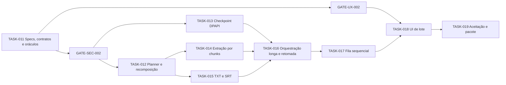

# Segundo incremento — mídia longa e lote

- **Status:** aprovado; implementação liberada pelos gates SEC/UX
- **Features:** FEAT-002 e FEAT-003
- **Meta:** uma mudança revisável por tarefa, sem chamada paga

| Ordem | Tarefa | Resultado observável | Gate |
|---:|---|---|---|
| 11 | TASK-011 | specs/ADRs/schemas/vetores aprováveis | SEC e UX antes de código |
| 12 | TASK-012 | plano e merge puros passam nos goldens | segurança aprovada |
| 13 | TASK-013 | checkpoint cifrado, íntegro e expirável | segurança aprovada |
| 14 | TASK-014 | FFmpeg extrai chunks abaixo do limite | segurança aprovada |
| 15 | TASK-015 | writers TXT/SRT atômicos | segurança aprovada |
| 16 | TASK-016 | arquivo longo retoma e recompõe | segurança aprovada |
| 17 | TASK-017 | fila FIFO isolada, um ativo | segurança aprovada |
| 18 | TASK-018 | tabela/ações acessíveis e responsivas | UX aprovada |
| 19 | TASK-019 | gauntlet, screenshots e candidato | novo aceite UX antes de release |

## Estratégia de testes antes do código

TASK-011 versiona schemas, exemplos e vetores; os testes verificam completude, privacidade e
consistência desses oráculos. Cada tarefa seguinte começa conectando o oráculo à unidade pública
correspondente e só então implementa. Alterar um vetor exige mudança de requisito justificada.

## Limites operacionais

- todos os PRs rodam sem rede, chave e mídia pessoal;
- nenhuma dependência nova está autorizada; DPAPI usa APIs do Windows por adapter;
- testes FFmpeg geram mídia sintética curta e simulam duração/tamanho quando possível;
- publicação, instalação e chamada real continuam gates independentes.
